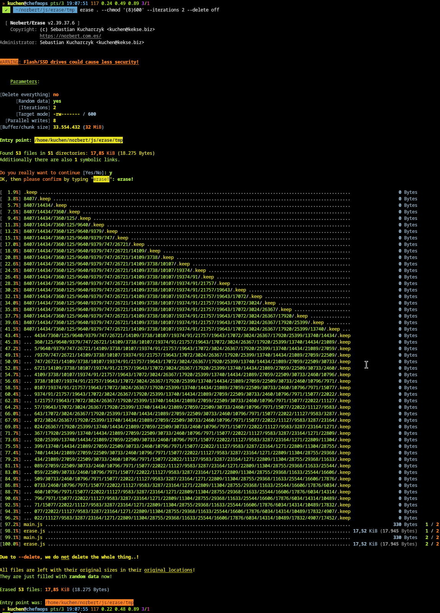

 

# Erase.js

The plan is to wipe all the [**Termux Linux**](https://termux.dev/) files
on my smartphone (more/less) securely.. by traversing a directory and
overwriting all files with exactly the same amount of `\0` or random bytes.

Without jailbreak one can't `dd` the whole disk drive(s).
So I needed to do this directly on file level..

 

## Flash/SSD drives

> [!WARNING]
> On Flash drives it's not perfectly secure.. but I'll research a bit more for this issue.

I think the solution for their insecurity is to fill with random/null until no space
is free, and then delete everything again. Right?!

But this is still a [**TODO**](#todo) item. Should be ready very soon..

 

## News
* \[**2025-05-14**\] Completely **rewritten** from scratch (no current screenshot available yet)!
* \[**2025-05-01**\] ATM I'm implementing everything again, just from scratch (w/ all [TODO](#todo) items this time);
* \[**2025-04-27**\] Just published an [example screenshot](#screenshot) here.
* \[**2025-04-25**\] Now also w/ `--chmod` (plus [config.js](#parameters-and-configuration) change);
* \[**2025-04-25**\] Made this app more secure by calling `fsync` after each iteration.
* \[**2025-04-22**\] Beautyfied and fixed last errors w/ the ANSI sequences and strings.. looks great.
* \[**2025-04-22**\] Removed the 'simulation' debug switch.. the whole thing should work well now.
* \[**2025-04-22**\] Now also supporting pure files instead of only an entry directory.
* \[**2025-04-14**\] Nearly finished.. the `--iterations` is now also ready.
* \[**2025-04-13**\] It should work well now.. but there's still a tiny [`TODO.txt`](#todo)
* \[**2025-04-09**\] Created this repository (I'm already working on this tool, right now);

 

## Download
Here's the newest (second) version available (which isn't even covered by the
[screenshot](#screenshot) below. Much better code, beautified everything up,
and most [TODO](#todo) items are integrated now.

* [**`./src/js/`**](src/js/) (updated **2025-05-14**);
* [**`./src/sh/`**](src/sh/) (published **2025-05-14**);

### Parameters and Configuration
* [**`param.json`**](src/json/param.json) (updated **2025-05-14**);
* [**`config.json`**](src/json/config.json) (updated **2025-05-14**);

 

## Architecture/Structure
This project is also based on some base implementation which is currently
not available for public; **it won't run as-is**!

The reason I made this one public is to provide you some example code you could use.
Or feel free to create a full fledged version out of this one.

## Screenshot
This is an [example screenshot](img/example.png).

> [!WARNING]
> This one shows the **first version** only!
> My newest rewrite (from scratch) looks completely different!

## TODO
There's one little [**`TODO.txt`**](docs/TODO.txt) for this (sub-)project.

  

# Contact

# Copyright and License
The Copyright is [(c) Sebastian Kucharczyk](./COPYRIGHT.txt),
and it's licensed under the [MIT](./LICENSE.txt) (also known as 'X' or 'X11' license).

